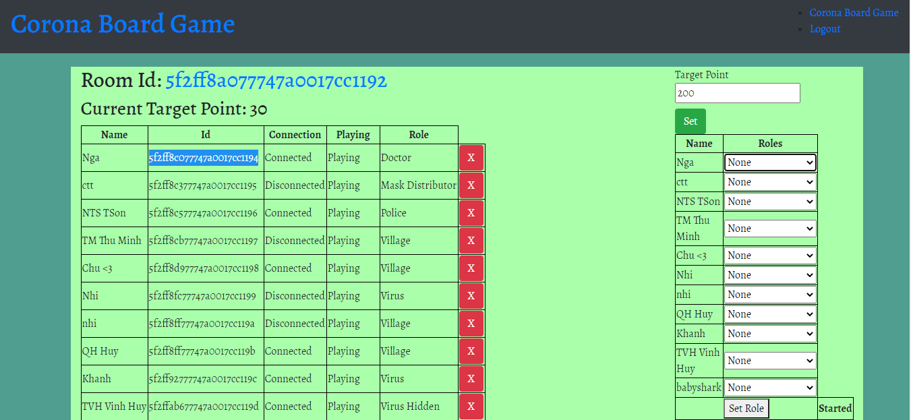
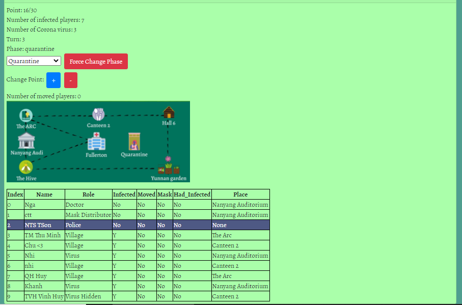
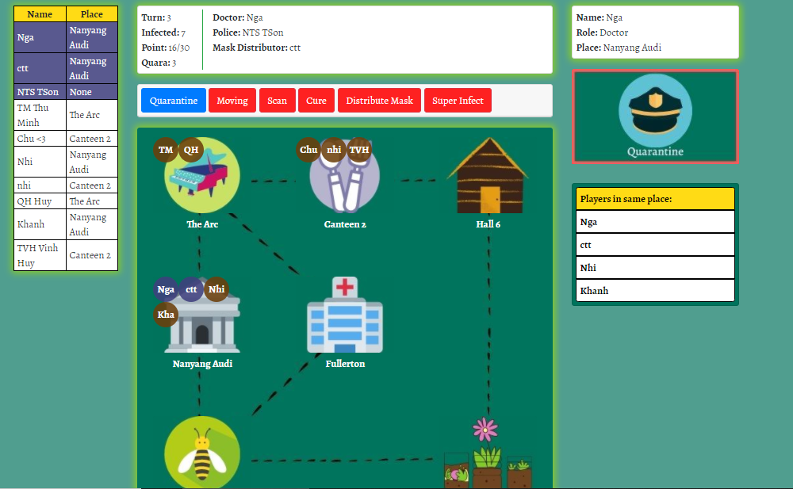

# corona_game_server
## Description
This game is a role-hidden game, which is similar to Werewolf, Avalon,... .The difference is the players will move around a map and take action base on the position of other players.
Please contact `lekynam2000@gmail.com` for further detail.
## Create DB 
Please create a .env file in this format:
```
JWTsecret=<your secret>
mongoURI=<your Mongo URI>
```
## Run the project locally by
```
./build.sh
```
Then open `localhost:5000/login` and sign up an admin account.

## Some illustration




